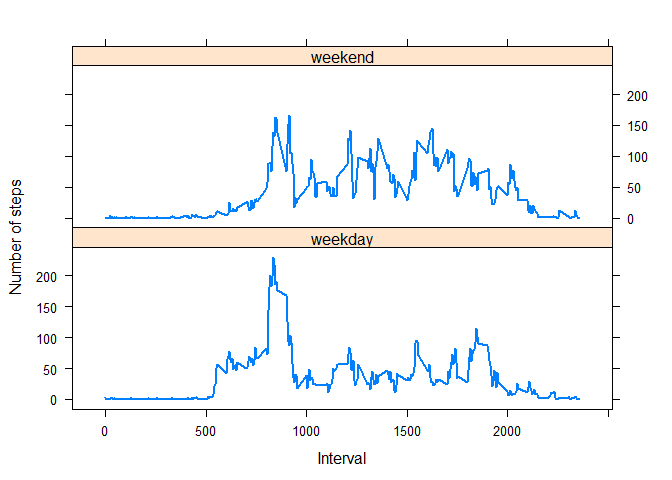

# Reproducible Research: Peer Assessment 1
=======================Notes====================


github repo with RMarkdown source code:https://github.com/neofloat/RepData_PeerAssessment1.git

Preview of this html file:  http://htmlpreview.github.io/?https://github.com/neofloat/RepData_PeerAssessment1/blob/master/PA1_template.html

Histogram is not barplot. More information can be found here: https://class.coursera.org/repdata-007/forum/thread?thread_id=1

=======================Start====================

## Loading and preprocessing the data
### check the format of the data loaded
1. read the csv data from the "activity.csv", and save to data frame "data".
 - assign the column classes of steps, date and interval to be "integer","Date" and "integer", respectively. The column class format and first 10 rows are shown.

```r
data<-read.csv("activity.csv", header=TRUE, stringsAsFactors=FALSE, colClasses=c("integer","Date","integer"))
sapply(data, class)
```

```
##     steps      date  interval 
## "integer"    "Date" "integer"
```

```r
head(data)
```

```
##   steps       date interval
## 1    NA 2012-10-01        0
## 2    NA 2012-10-01        5
## 3    NA 2012-10-01       10
## 4    NA 2012-10-01       15
## 5    NA 2012-10-01       20
## 6    NA 2012-10-01       25
```

2. transform the data set to another data frame named "avgstepperday", the two columns of which are the date and averge steps taken in that date. The column class format and first 10 rows are shown.


```r
avg<-tapply(data$steps, data$date, mean, na.rm=T)
avgstepperday<-data.frame(date=as.Date(names(avg)), steps=as.numeric(avg))
sapply(avgstepperday, class)
```

```
##      date     steps 
##    "Date" "numeric"
```

```r
head(avgstepperday)
```

```
##         date   steps
## 1 2012-10-01     NaN
## 2 2012-10-02  0.4375
## 3 2012-10-03 39.4167
## 4 2012-10-04 42.0694
## 5 2012-10-05 46.1597
## 6 2012-10-06 53.5417
```

3. transform the data set to another data frame named "avgstepintv", the two columns of which are the interval and averge steps taken over all of days. The column class format and first 10 rows are shown.


```r
avgintv<-tapply(data$steps, data$interval, mean, na.rm=T)
avgstepintv<-data.frame(interval=as.integer(names(avgintv)), steps=as.numeric(avgintv))
sapply(avgstepintv, class)
```

```
##  interval     steps 
## "integer" "numeric"
```

```r
head(avgstepintv)
```

```
##   interval   steps
## 1        0 1.71698
## 2        5 0.33962
## 3       10 0.13208
## 4       15 0.15094
## 5       20 0.07547
## 6       25 2.09434
```


## What is mean total number of steps taken per day?
1.Make a histogram of the total number of steps taken each day

```r
hist(avgstepperday$steps,main="histogram of the total number of steps taken each day",
     xlab = "the total number of steps taken each day", col="red")
```

 

2.Calculate the mean and median total number of steps taken per day

```r
#mean total number of steps taken per day
ma<-mean(avgstepperday$steps, na.rm=TRUE)
ma
```

```
## [1] 37.38
```

```r
#median total number of steps taken per day
mm<-median(avgstepperday$steps, na.rm=TRUE)
mm
```

```
## [1] 37.38
```

**Solution:** 
  The mean  total number of steps taken per day is 37.3826.
  The median total number of steps taken per day is 37.3785.


## What is the average daily activity pattern?
1.Make a time series plot (i.e. type = "l") of the 5-minute interval (x-axis) and the average number of steps taken, averaged across all days (y-axis)


```r
plot(avgstepintv$interval, avgstepintv$steps,  type="l", main="", xlab="interval in a day",ylab="Average Number of Steps", col="blue", lwd=2)
```

 


2.Which 5-minute interval, on average across all the days in the dataset, contains the maximum number of steps?


```r
max<-avgstepintv[order(avgstepintv[,2],decreasing=T),][1,]
max
```

```
##     interval steps
## 104      835 206.2
```

**Solution:** 
- interval 835 contains the maximum number of steps on averge across all the days, which is 206.1698.

## Imputing missing values
1. Calculate and report the total number of missing values in the dataset (i.e. the total number of rows with NAs)


```r
missing<-sum(is.na(data[,1]))
```

**Solution:** 2304 values are missing in the dataset.

2. Devise a strategy for filling in all of the missing values in the dataset. The strategy does not need to be sophisticated. For example, you could use the mean/median for that day, or the mean for that 5-minute interval, etc.


**Solution:** The strategy is to fill the missing value in the dataset with the mean for that 5-minute interval of all the days.


3. Create a new dataset that is equal to the original dataset but with the missing data filled in.


```r
fulldata<-merge(data,avgstepintv, by.x="interval", by.y="interval")
fulldata[is.na(fulldata[,2]),2] <-fulldata[is.na(fulldata[,2]),4]
names(fulldata)[c(2,4)]<-c("steps", "mean steps")
```

**Solution:** A new data set "fulldata" is created by merge the original data set and the mean steps of 5-minite interval of all the days. The missing data of the steps are replaced with the the mean for that 5-minute interval of all the days.


4. Make a histogram of the total number of steps taken each day and Calculate and report the mean and median total number of steps taken per day. Do these values differ from the estimates from the first part of the assignment? What is the impact of imputing missing data on the estimates of the total daily number of steps?


```r
avg2<-tapply(fulldata$steps, fulldata$date, mean)
avgstepperday2<-data.frame(date=as.Date(names(avg2)), steps=as.numeric(avg2))
hist(avgstepperday2$steps,main="Histogram of the total number of steps taken each day",
     xlab = "the total number of steps taken each day", col="red")
```

 

```r
#mean total number of steps taken per day
ma2<-mean(avgstepperday2$steps)
ma2
```

```
## [1] 37.38
```

```r
#median total number of steps taken per day
mm2<-median(avgstepperday2$steps)
mm2
```

```
## [1] 37.38
```

**Solution:**
   The mean  total number of steps taken per day is 37.3826.
   The median total number of steps taken per day is 37.3826.
There is no change on the mean and median total number of steps taken per day. However, the imputing missing data changes the histogram of the total number of steps taken each day. By replacing the missing value with the the mean for that 5-minute interval of all the days, the largest number of counts get increased.


## Are there differences in activity patterns between weekdays and weekends?
1. Create a new factor variable in the dataset with two levels – “weekday” and “weekend” indicating whether a given date is a weekday or weekend day.


```r
fulldata$week<-ifelse(!weekdays(fulldata$date)%in%c("Saturday", "Sunday"), "weekday", "weekend")
head(fulldata)
```

```
##   interval steps       date mean steps    week
## 1        0 1.717 2012-10-01      1.717 weekday
## 2        0 0.000 2012-11-23      1.717 weekday
## 3        0 0.000 2012-10-28      1.717 weekend
## 4        0 0.000 2012-11-06      1.717 weekday
## 5        0 0.000 2012-11-24      1.717 weekend
## 6        0 0.000 2012-11-15      1.717 weekday
```

2. Make a panel plot containing a time series plot (i.e. type = "l") of the 5-minute interval (x-axis) and the average number of steps taken, averaged across all weekday days or weekend days (y-axis). The plot should look something like the following, which was creating using simulated data:


**Note:**
The first plot is from the example, and the next plot is obtained from my data.


3. Your plot will look different from the one above because you will be using the activity monitor data. Note that the above plot was made using the lattice system but you can make the same version of the plot using any plotting system you choose.


```r
weekday<-fulldata[which(fulldata$week=="weekday"), c(1,2)]
weekend<-fulldata[which(fulldata$week=="weekend"), c(1,2)]
agvwkd<-tapply(weekday$steps, weekday$interval, mean)
avgweekday<-data.frame(interval=as.integer(names(agvwkd)), steps=as.numeric(agvwkd), date=as.factor(rep("weekday", nrow(agvwkd))))
head(avgweekday)
```

```
##   interval   steps    date
## 1        0 2.25115 weekday
## 2        5 0.44528 weekday
## 3       10 0.17317 weekday
## 4       15 0.19790 weekday
## 5       20 0.09895 weekday
## 6       25 1.59036 weekday
```

```r
agvwkend<-tapply(weekend$steps, weekend$interval, mean)
avgweekend<-data.frame(interval=as.integer(names(agvwkend)), steps=as.numeric(agvwkend),date=as.factor(rep("weekend", nrow(agvwkend))))
head(avgweekend)
```

```
##   interval    steps    date
## 1        0 0.214623 weekend
## 2        5 0.042453 weekend
## 3       10 0.016509 weekend
## 4       15 0.018868 weekend
## 5       20 0.009434 weekend
## 6       25 3.511792 weekend
```

```r
week<-rbind(avgweekday, avgweekend)
summary(week)
```

```
##     interval        steps             date    
##  Min.   :   0   Min.   :  0.00   weekday:288  
##  1st Qu.: 589   1st Qu.:  2.05   weekend:288  
##  Median :1178   Median : 28.13                
##  Mean   :1178   Mean   : 38.99                
##  3rd Qu.:1766   3rd Qu.: 61.26                
##  Max.   :2355   Max.   :230.38
```

```r
library(lattice)
xyplot(week$steps~week$interval |date, data = week, type ="l", layout=c(1,2), xlab=c("Interval"),
        ylab=c("Number of steps"), lwd=2)
```

 

**Solution:**
This plot contains two panels. It shows the time series of the 5-minute interval (x-axis) and the average number of steps taken, averaged across all weekday days or weekend days.

=======================End====================
